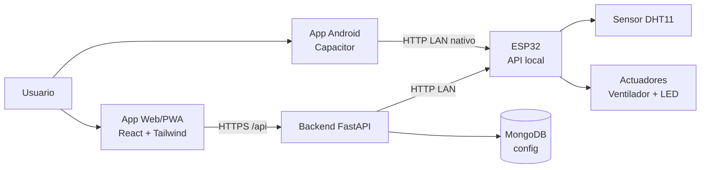
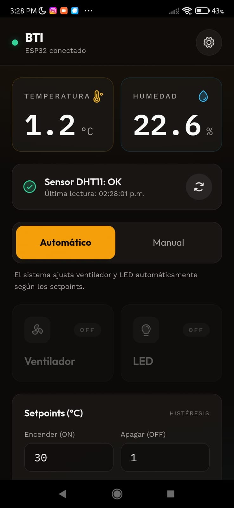
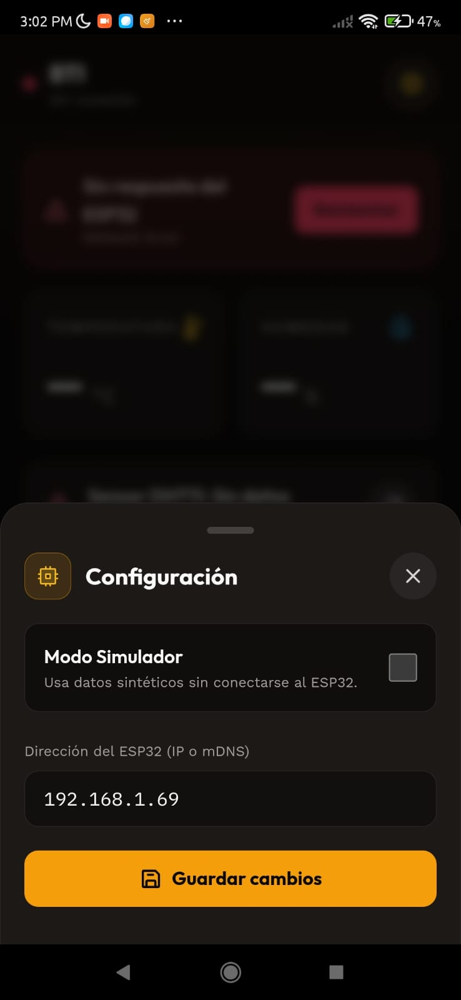

# BIT (Bota Terapéutica Inteligente)

## Descripción del Sistema

BIT es un sistema IoT de soporte terapéutico para pie diabético en etapas tempranas, orientado a mantener un entorno controlado de tratamiento y monitoreo continuo.

El sistema integra:

- Un firmware en ESP32 que adquiere variables ambientales (temperatura y humedad), ejecuta lógica de control automático por histéresis y expone una API HTTP local.
- Un backend FastAPI que funciona como capa de integración, proxy y persistencia de configuración.
- Una interfaz móvil y web (PWA React), además de empaquetado Android con Capacitor, para operación clínica y domiciliaria.

Su propósito técnico es habilitar monitoreo en tiempo real y control remoto de parámetros de operación sin depender de visitas hospitalarias constantes.

## Arquitectura del Sistema

Arquitectura híbrida cliente-servidor + IoT, con dos rutas operativas:

1. Ruta proxy (operación web estándar)
   - Cliente React/PWA -> FastAPI (/api) -> ESP32 (HTTP LAN)
2. Ruta directa (operación móvil nativa)
   - App Android (Capacitor) -> ESP32 (HTTP LAN, vía cliente HTTP nativo)

Componentes:

- Capa de presentación: React 18 con interfaz mobile-first.
- Capa de servicios: FastAPI con validación, manejo de errores y proxy de endpoints.
- Capa de datos: MongoDB para persistencia de configuración operativa.
- Capa de dispositivo: ESP32 con DHT11 y actuadores (ventilador/LED).

Modelo de interacción:

- Polling periódico de estado cada 2 segundos.
- Control manual y automático mediante endpoints de comando.
- Persistencia de configuración de IP y modo simulador.
- Mecanismo de fallback para mantener continuidad operativa entre backend y acceso directo al dispositivo.

## Diagrama de Arquitectura

## Tecnologías Utilizadas

Tipo de sistema:

- IoT + Aplicación web (PWA) + Aplicación móvil Android + API backend.

Frameworks y librerías:

- Frontend: React 18, react-scripts, Tailwind CSS, Axios, Phosphor Icons.
- Móvil: Capacitor Core, Capacitor Android, Capacitor CLI.
- Backend: FastAPI, Uvicorn, HTTPX, Pydantic.
- Persistencia: Motor (driver asíncrono), PyMongo.
- Firmware: Arduino framework para ESP32 con WiFi.h, WebServer.h y DHT.h.

Lenguajes de programación:

- JavaScript
- Python
- C/C++ (Arduino para ESP32)
- TypeScript (configuración de Capacitor)

Herramientas de desarrollo:

- Node.js y npm
- Pip
- Gradle Wrapper (compilación Android)

Usuarios objetivo:

- Pacientes con pie diabético en etapas tempranas (1 a 3).
- Personal clínico y de enfermería para seguimiento de parámetros.
- Cuidadores y familiares que asisten en la operación diaria.

## Estructura del Proyecto

Estructura principal del repositorio:

- backend
  - API FastAPI, lógica de simulador, proxy a ESP32 y acceso a MongoDB.
- firmware
  - Código fuente Arduino para ESP32, sensores y actuadores.
- frontend/src
  - Componentes UI, hooks, validaciones y cliente de API.
- frontend/android
  - Proyecto Android generado con Capacitor (build nativo de APK).
- test_reports
  - Evidencia y reportes de validación del sistema.

## Base de Datos

Tipo de base de datos:

- MongoDB (NoSQL documental).

Modelo de datos actual:

- Base: bti_db
- Colección principal: config
- Documento principal: default

Campos del documento de configuración:

- ip: dirección del ESP32 (IPv4 o hostname local).
- simulator: bandera booleana para habilitar modo simulador.

Relaciones:

- En la versión actual no hay relaciones entre múltiples colecciones transaccionales.
- La colección config se relaciona lógicamente con la capa de servicios (FastAPI) para enrutar solicitudes al dispositivo real o al simulador.

## Funcionalidades Principales

- Monitoreo en tiempo real de temperatura y humedad.
- Cambio de modo de operación automático/manual.
- Control manual de actuadores (ventilador y LED) cuando el modo lo permite.
- Configuración dinámica de setpoints con validación de histéresis.
- Gestión de IP de dispositivo y modo simulador.
- Detección y notificación de fallas de comunicación.
- Soporte multiplataforma: navegador móvil y APK Android.

## Flujo del Sistema

1. El usuario abre la app y configura IP del ESP32 o activa simulador.
2. El cliente inicia consulta periódica de estado.
3. El backend o el cliente móvil directo obtiene datos del ESP32.
4. El sistema renderiza métricas y estado de salud del sensor.
5. El usuario selecciona modo automático o manual.
6. Si está en manual, envía comandos de actuadores.
7. El usuario ajusta setpoints dentro de reglas de histéresis.
8. La app confirma respuesta, actualiza interfaz y mantiene monitoreo continuo.

## Instalación y Ejecución

Requisitos mínimos:

- Python 3.10+
- Node.js 18+
- Java JDK 17+
- Android SDK (si se compila APK)
- MongoDB en ejecución
- ESP32 con firmware cargado (para pruebas en hardware)

Configuración backend:

Variables de entorno esperadas en backend/.env:

- MONGO_URL
- DB_NAME
- CORS_ORIGINS (opcional)

Ejecución backend:

    cd backend
    pip install -r requirements.txt
    uvicorn server:app --host 0.0.0.0 --port 8001 --reload

Ejecución frontend web:

    cd frontend
    npm install
    npm start

Compilación web de producción:

    cd frontend
    npm run build

Generación APK Android (Capacitor):

    cd frontend
    npx cap sync android
    cd android
    .\gradlew.bat assembleDebug

Firmware ESP32:

1. Abrir firmware/esp32_bti.ino en Arduino IDE.
2. Configurar credenciales WiFi.
3. Flashear en ESP32 Dev Module.
4. Verificar IP asignada en monitor serial.

## Evidencia Técnica

Pruebas realizadas:

- Prueba de conectividad HTTP local entre móvil y ESP32.
- Validación de endpoints de estado, modo, manual y setpoints.
- Verificación de fallback de comunicación en app móvil.
- Validación de persistencia de configuración en MongoDB.
- Prueba funcional de compilación Android y generación de APK.

Estado actual:

- Prototipo funcional avanzado.
- Integración operativa entre frontend, backend y firmware.
- Aplicación Android compilable y validada en entorno real de red local.

## Visualización de Pantallas

Las capturas funcionales del sistema se almacenan en `docs/pantallas/` con la siguiente nomenclatura:

- `pantalla_1.jpeg`
- `pantalla_2.jpeg`

Renderizado en README:

### pantalla_1

### pantalla_2

## Escalabilidad y Mejoras Futuras

- Registro histórico de telemetría en base de datos para análisis longitudinal.
- Panel de tendencias y alertamiento clínico por umbrales.
- Gestión multi-dispositivo por paciente o unidad médica.
- Seguridad reforzada: autenticación, autorización y cifrado de tráfico interno.
- Exportación de reportes clínicos (CSV/PDF) para seguimiento médico.
- Estrategias de observabilidad: métricas, trazas y monitoreo de disponibilidad.
- Pipeline de pruebas automatizadas (unitarias, integración y pruebas de dispositivo).
